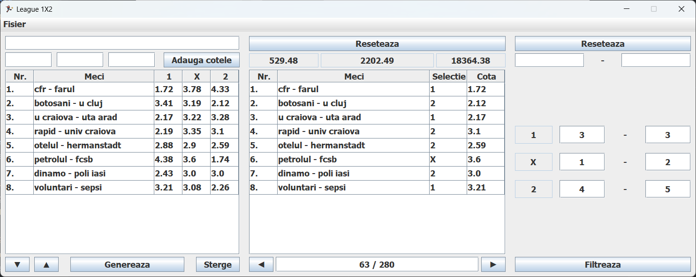

## League 1X2

The user is able to enter the betting odds 
for all the football matches in a league 
and generate all the combinations.
From here onwards user can edit the entered data, 
navigate or filter through the generated tickets 
depending on the betting strategy
or export the entered list of games 
to a config file 
and import it later.

